# Objective

Given the limited resources avaialble in a virtualized sandbox, you may choose to turn specific services on or off.  You may choose to enable or disable security, such as Kerberos.  Depending on your scenario, you may have a need to switch between these configurations frequently.  For reproduceable demos, you likely do not want to make these changes between one demo and the next.  If you are like me, you may want to have different copies of HDP sandboxes to cover different demo scenarios.

With VirtualBox or VMWare sandboxes, you can easily import or clone a sandbox to have muliple, distinct copies.  EAch copy is unique with no sharing of configuration or data.  However, this approach is not quite as intuitive when using the Docker sandbox.  If you tried to create multiple containers on a Docker image thinking they would be separate copies, you likely have found they are not completely separate!

This tutorial will guide you through the process of using a single sandbox image, with multiple containers, without sharing the sandbox HDP configurations by mapping the container's /hadoop directory to distinct paths within the Docker VM.

# Prerequisites

- You should have already completed this tutorial: [HCC Tutorial] (https://community.hortonworks.com/content/kbentry/58458/installing-docker-version-of-sandbox-on-mac.html)

# Scope

This tutorial was tested using the following environment and components:

- Mac OS X 10.11.6
- HDP 2.5 on Hortonworks Sandbox (Docker Version)
- Docker for Mac 1.12.1

# Steps

## Identify where container storage is located

The create container command, which was run in the previous tutorial, specifies a directory mount of `-v hadoop:/hadoop`.  This tells Docker to create the container with a mount of `/hadoop` that points to the VM host location `hadoop` which is a relative path.  We are trying to figure out where this location is.

To see what storage mounts our Docker container has, we can use the `docker inspect` command.  If you followed my tutorial, we created the container and gave it the name `sandbox`.  In the output of this command you want to look for the `Mounts` section.

```bash
$ docker inspect sandbox
```

You should see something similar to this:

```json
$ docker inspect sandbox

...
       "Mounts": [
            {
                "Name": "hadoop",
                "Source": "/var/lib/docker/volumes/hadoop/_data",
                "Destination": "/hadoop",
                "Driver": "local",
                "Mode": "z",
                "RW": true,
                "Propagation": "rprivate"
            }
        ],
...
```

From this output we can see that `/hadoop` is pointing to `/var/lib/docker/volumes/hadoop/_data`.  So let's see what's in that location.

```bash
$ ls /var/lib/docker/volumes/hadoop/_data
ls: /var/lib/docker/volumes/hadoop/_data: No such file or directory
```

The directory doesn't exist.  Why is this?  The latest version of Docker for Mac is uing Hyperkit ([Hyperkit](https://github.com/docker/hyperkit)) as the virtualization layer.  Previous versions used VirtualBox as the virtualization layer.  Both versions use a common VM to run all of the containers.  So the `Source` path is not on the Mac itself, rather it is on the host VM.

So let's connect to the Docker VM to see if the directory exists there. The following command will start a temporary container based on an Alpine Linux image that mounts the Docker VMs root directory as `/vm-root` and then does an `ls -latr` on it.

```bash
$ docker run --rm -it -v /:/vm-root alpine:edge ls -latr /vm-root/var/lib/docker/volumes/
```

You should see something similar to this:

```bash
$ docker run --rm -it -v /:/vm-root alpine:edge ls -latr /vm-root/var/lib/docker/volumes/
total 88
drwx--x--x   10 root     root          4096 Aug 24 20:07 ..
drwxr-xr-x    3 root     root          4096 Sep 19 21:25 9ab350e3947fc409819cc0924401d863fe84f5c45ea4243bcecf3e91a0741068
drwxr-xr-x    3 root     root          4096 Sep 20 15:51 330351a101d34c3f0ed4f4ee7c3ef4277754a2cadd68d711e8e871aa09280e39
drwxr-xr-x    3 root     root          4096 Sep 25 18:03 hadoop
drwxr-xr-x    3 root     root          4096 Sep 28 21:13 ae64ecf489ceac45866a35b3babdf4773f67ba555acc5d45b1d52f9f305a964f
drwxr-xr-x    3 root     root          4096 Sep 28 23:03 088a11867381704183ac9116ad3da0513c03885665e9e03049432363d2884d1e
drwxr-xr-x    3 root     root          4096 Sep 28 23:17 f6f28886b2f50f72c52081dc2e9339678b9ecf4910564e14531c3ca6c8791974
drwxr-xr-x    3 root     root          4096 Oct  5 13:45 c6825d9c9c6933549a446bf45924db641b65a632c18da662b15a109dc46b5f15
drwxr-xr-x    3 root     root          4096 Oct  5 13:48 6ea352c744531d4c53e699df5eafde40100e4935c7398917714ed33ee7fe5f73
drwxr-xr-x    3 root     root          4096 Oct  5 13:49 151490435ffcd759c266049b24cf3a18759c5fd3e26f1a05357973e318a8b117
drwxr-xr-x    3 root     root          4096 Oct  5 13:50 a0575116e211d35d94ee648822a1bf035c708f90bf7e9620061753a3f34be150
-rw-------    1 root     root         65536 Oct  7 18:46 metadata.db
drwx------   14 root     root          4096 Oct  7 18:46 .
```

There it is!  You should see the `hadoop` directory in your output.  Let's take a quick look inside of that directory by modifying our previouis Docker command:

```bash
$ docker run --rm -it -v /:/vm-root alpine:edge ls -latr /vm-root/var/lib/docker/volumes/hadoop/_data
```

You should see something similar to this:

```bash
$ docker run --rm -it -v /:/vm-root alpine:edge ls -latr /vm-root/var/lib/docker/volumes/hadoop/_data
total 36
drwxr-xr-x    3 516      501           4096 Sep 13 10:54 zookeeper
drwxr-xr-x    3 513      501           4096 Sep 13 10:56 mapreduce
drwxr-xr-x    5 506      501           4096 Sep 13 10:56 hdfs
drwxr-xr-x    5 520      501           4096 Sep 13 10:58 yarn
drwxr-xr-x    3 506      501           4096 Sep 13 10:59 oozie
drwxr-xr-x    5 518      501           4096 Sep 13 11:02 falcon
drwxr-xr-x    3 root     root          4096 Sep 25 18:03 ..
drwxr-xr-x    9 506      501           4096 Sep 28 20:36 .
drwxr-xr-x    7 510      501           4096 Oct  5 21:37 storm
```

As you can see, this where container is storing the data for the `/hadoop` mount.  The problem with this is that mount is the same for every container that runs that image using the run command we provided before.

## Create a new project directory

I like to create project directories.  My Vagrant work goes under `~/Vagrant/<project>` and my Docker work goes under `~/Docker/<project>`.  This allows me to cleary identify which technology is associated with the projects and allows me to use various helper scripts to automate processes, etc.  So let's create project directory for an notional Atlas demo.

```bash
mkdir -p ~/Docker/atlas-demo1 && cd ~/Docker/atlas-demo1
```

## Create the project helper files

To make it easy to switch between containers and projects, I like to create 4 helper scripts.  You can copy/paste the scripts as described below, or you can download them the attachments section of this article.

### create-container.sh

The first script is used to create the container: create-container.sh.  In this script we'll be using a similar `docker run` command as used in the previous tutorial.  However, we are going to modify the mounts so they are no longer shared.  The key change is we are doing grab the basename of our current project directory and use that name as our mount pount.  We are using the basename of our project directory for the `--name` of the container.  In this case, the basename is `atlas-demo1`.  The last change you should notice is we have added a second -v flag.  This addition mounts our local project directory to `/mount` within the container.  This makes it really easy to copy data back and forth between our local directory and the container.

Edit the create-container.sh file `vi create-container.sh`.

Copy and paste the following into your file:

```bash
#!/bin/bash

export CUR_DIR=`pwd`
export PROJ_DIR=`basename $CUR_DIR`

docker run -v `pwd`:/mount -v ${PROJ_DIR}:/hadoop --name ${PROJ_DIR}  --hostname "sandbox.hortonworks.com" --privileged -d \
-p 6080:6080 \
-p 9090:9090 \
-p 9000:9000 \
-p 8000:8000 \
-p 8020:8020 \
-p 42111:42111 \
-p 10500:10500 \
-p 16030:16030 \
-p 8042:8042 \
-p 8040:8040 \
-p 2100:2100 \
-p 4200:4200 \
-p 4040:4040 \
-p 8050:8050 \
-p 9996:9996 \
-p 9995:9995 \
-p 8080:8080 \
-p 8088:8088 \
-p 8886:8886 \
-p 8889:8889 \
-p 8443:8443 \
-p 8744:8744 \
-p 8888:8888 \
-p 8188:8188 \
-p 8983:8983 \
-p 1000:1000 \
-p 1100:1100 \
-p 11000:11000 \
-p 10001:10001 \
-p 15000:15000 \
-p 10000:10000 \
-p 8993:8993 \
-p 1988:1988 \
-p 5007:5007 \
-p 50070:50070 \
-p 19888:19888 \
-p 16010:16010 \
-p 50111:50111 \
-p 50075:50075 \
-p 50095:50095 \
-p 18080:18080 \
-p 60000:60000 \
-p 8090:8090 \
-p 8091:8091 \
-p 8005:8005 \
-p 8086:8086 \
-p 8082:8082 \
-p 60080:60080 \
-p 8765:8765 \
-p 5011:5011 \
-p 6001:6001 \
-p 6003:6003 \
-p 6008:6008 \
-p 1220:1220 \
-p 21000:21000 \
-p 6188:6188 \
-p 61888:61888 \
-p 2181:2181 \
-p 2222:22 \
sandbox /usr/sbin/sshd -D
```

Now save your file with `:wq!`

### start-container.sh

The second script is used to start the container after it has been created.  You start a container by using the `docker start <container>` command where container is either the name or id.  Instead of having to remember what the container name is, we'll have the script figure that out for us.

Edit the start-container.sh file `vi start-container.sh`.

Copy and paste the following into your file:

```bash
#!/bin/bash

export CUR_DIR=`pwd`
export PROJ_DIR=`basename $CUR_DIR`
docker start ${PROJ_DIR}
```

Now save your file with `:wq!`

### stop-container.sh

The third script is used to stop the container after it has been created.  You stop a container by using the `docker stop <container>` command where container is either the name or id.  Instead of having to remember what the container name is, we'll have the script figure that out for us.

Edit the stop-container.sh file `vi stop-container.sh`.

Copy and paste the following into your file:

```bash
#!/bin/bash

export CUR_DIR=`pwd`
export PROJ_DIR=`basename $CUR_DIR`
docker stop ${PROJ_DIR}
```

Now save your file with `:wq!`

### ssh-container.sh

The fourth script is used to ssh into the container.  The container maps the local host port 2222 to the container port 22 via the `-p 2222:22` line in the `create-container.sh` script.  Admittedly the ssh command to connect is simple.  However this script means I don't have to think about it very much.  Edit the ssh-container.sh file `vi ssh-container.sh`.

Copy and paste the following into your file:

```bash
#!/bin/bash

ssh -p 2222 root@localhost
```

Now save your file with `:wq!`

## Create the atlas-demo1 container

Now that we have our helper scripts ready to go, let's create the container for our notional Atlas demo.

```bash
$ cd ~/Docker/atlas-demo1
$ ./create-container.sh
```

You should see something similar to the following:

```bash
$ ./create-container.sh
9366e0b23a72ea53581647e174b50e5d24ec08a217c1bf3591491ad74ab18028
```

The output of the docker run command is the unique container id for our `atlas-demo1` container.  You can verify the container is running with the `docker ps` command:

```bash
$ docker ps
CONTAINER ID        IMAGE               COMMAND               CREATED             STATUS              PORTS                                                                                                                                                                                                                                                                                                                                                                                                                                                                                                                                                                                                                                                                                                                                                                                                                                                                                                                                                                                                                                                                                                                                                                                                                                                                                                                                                                                                                                              NAMES
9366e0b23a72        sandbox             "/usr/sbin/sshd -D"   55 seconds ago      Up 53 seconds       0.0.0.0:1000->1000/tcp, 0.0.0.0:1100->1100/tcp, 0.0.0.0:1220->1220/tcp, 0.0.0.0:1988->1988/tcp, 0.0.0.0:2100->2100/tcp, 0.0.0.0:2181->2181/tcp, 0.0.0.0:4040->4040/tcp, 0.0.0.0:4200->4200/tcp, 0.0.0.0:5007->5007/tcp, 0.0.0.0:5011->5011/tcp, 0.0.0.0:6001->6001/tcp, 0.0.0.0:6003->6003/tcp, 0.0.0.0:6008->6008/tcp, 0.0.0.0:6080->6080/tcp, 0.0.0.0:6188->6188/tcp, 0.0.0.0:8000->8000/tcp, 0.0.0.0:8005->8005/tcp, 0.0.0.0:8020->8020/tcp, 0.0.0.0:8040->8040/tcp, 0.0.0.0:8042->8042/tcp, 0.0.0.0:8050->8050/tcp, 0.0.0.0:8080->8080/tcp, 0.0.0.0:8082->8082/tcp, 0.0.0.0:8086->8086/tcp, 0.0.0.0:8088->8088/tcp, 0.0.0.0:8090-8091->8090-8091/tcp, 0.0.0.0:8188->8188/tcp, 0.0.0.0:8443->8443/tcp, 0.0.0.0:8744->8744/tcp, 0.0.0.0:8765->8765/tcp, 0.0.0.0:8886->8886/tcp, 0.0.0.0:8888-8889->8888-8889/tcp, 0.0.0.0:8983->8983/tcp, 0.0.0.0:8993->8993/tcp, 0.0.0.0:9000->9000/tcp, 0.0.0.0:9090->9090/tcp, 0.0.0.0:9995-9996->9995-9996/tcp, 0.0.0.0:10000-10001->10000-10001/tcp, 0.0.0.0:10500->10500/tcp, 0.0.0.0:11000->11000/tcp, 0.0.0.0:15000->15000/tcp, 0.0.0.0:16010->16010/tcp, 0.0.0.0:16030->16030/tcp, 0.0.0.0:18080->18080/tcp, 0.0.0.0:19888->19888/tcp, 0.0.0.0:21000->21000/tcp, 0.0.0.0:42111->42111/tcp, 0.0.0.0:50070->50070/tcp, 0.0.0.0:50075->50075/tcp, 0.0.0.0:50095->50095/tcp, 0.0.0.0:50111->50111/tcp, 0.0.0.0:60000->60000/tcp, 0.0.0.0:60080->60080/tcp, 0.0.0.0:61888->61888/tcp, 0.0.0.0:2222->22/tcp   atlas-demo1
```

You should notice the shortened version of the container id is listed as `9366e0b23a72`.  It is the first 12 charactrers,  and it matches the output of our create-container.sh command.  Your container id value will be different.  You should also notice the name of the container is listed as `atlas-demo1`.

When you create a container with `docker run` it starts it for you.  That means you can connect to it without having to run the `start-container.sh` script.  After the container has been stopped, you will need to run `start-container.sh` to bring it up, NOT `create-container.sh`.

## Connect to the atlas-demo1 container

Now that the container is started, we can connect to it. We can use our new helper script `ssh-container.sh` to make it easy:

```bash
$ ./ssh-container.sh
```

You should be prompted for a password.  The default password on the sandbox is `hadoop`.  The first time you start log into a new container you will be prompted to change the password.  You should see something similar to this:

```bash
$ ./ssh-container.sh
root@localhost's password:
You are required to change your password immediately (root enforced)
Last login: Thu Sep 22 11:35:09 2016 from 172.17.0.1
Changing password for root.
(current) UNIX password:
New password:
Retype new password:
```

For demo purposes, I temporarily change it something new like `trymenow` and then change it back.

```bash
[root@sandbox ~]# passwd
Changing password for user root.
New password:
BAD PASSWORD: is too simple
Retype new password:
passwd: all authentication tokens updated successfully.
```

## Verify container mounts

Let's verify our container mounts.  You do this with the `df` command:

```bash
[root@sandbox ~]# df -h
Filesystem      Size  Used Avail Use% Mounted on
none             60G   32G   25G  57% /
tmpfs           5.9G     0  5.9G   0% /dev
tmpfs           5.9G     0  5.9G   0% /sys/fs/cgroup
/dev/vda2        60G   32G   25G  57% /hadoop
/dev/vda2        60G   32G   25G  57% /etc/resolv.conf
/dev/vda2        60G   32G   25G  57% /etc/hostname
/dev/vda2        60G   32G   25G  57% /etc/hosts
shm              64M  8.0K   64M   1% /dev/shm
osxfs           233T   33T  201T  15% /Users/myoung/Documents/Docker/atlas-demo1
```

The first thing you should notice is the last entry.  My local project directory is mounted as `osxfs`.  Let's `ls` the `/mount` directory to see what's there:

```bash
[root@sandbox ~]# ls -la /Users/myoung/Documents/Docker/atlas-demo1
total 300
drwxr-xr-x 12 root root      408 Oct  7 22:52 .
drwxr-xr-x  3 root root     4096 Oct  7 22:57 ..
-rwxrwxr-x  1 root root     1199 Oct  7 23:31 create-container.sh
-rwxrwxr-x  1 root root       40 Oct  7 22:52 ssh-container.sh
-rwxrwxr-x  1 root root       96 Oct  7 22:48 start-container.sh
-rwxrwxr-x  1 root root       95 Oct  7 22:48 stop-container.sh
```

You should see the 4 helper scripts we created.  If I want to easily make data available to the container, all I have to do is copy the data to my project directory.

## Start the sandbox processes

When the container starts up, it doesn't automatically start the sandbox processes.  You can do that by running the `/etc/inid./startup_script`.  You should see something similar to this:

```bash
[root@sandbox ~]# /etc/init.d/startup_script start
Starting tutorials...                                      [  Ok  ]
Starting startup_script...
Starting HDP ...
Starting mysql                                            [  OK  ]
Starting Flume                                            [  OK  ]
Starting Postgre SQL                                      [  OK  ]
Starting Ranger-admin                                     [WARNINGS]
find: failed to restore initial working directory: Permission denied
Starting data node                                        [  OK  ]
Starting name node                                        [  OK  ]
Safe mode is OFF
Starting Oozie                                            [  OK  ]
Starting Ranger-usersync                                  [  OK  ]
Starting Zookeeper nodes                                  [  OK  ]
Starting NFS portmap                                      [  OK  ]
Starting Hdfs nfs                                         [  OK  ]
Starting Hive server                                      [  OK  ]
Starting Hiveserver2                                      [  OK  ]
Starting Ambari server                                    [  OK  ]
Starting Ambari agent                                     [  OK  ]
Starting Node manager                                     [  OK  ]
Starting Yarn history server                              [  OK  ]
Starting Webhcat server                                   [  OK  ]
Starting Spark                                            [  OK  ]
Starting Mapred history server                            [  OK  ]
Starting Zeppelin                                         [  OK  ]
Starting Resource manager                                 [  OK  ]
Safe mode is OFF
Starting sandbox...
/etc/init.d/startup_script: line 97: /proc/sys/kernel/hung_task_timeout_secs: No such file or directory
Starting shellinaboxd:                                     [  OK  ]
```

**NOTE: You can ignore any warnings or errors that are displayed.**

Now the sandbox process are running and you can access the Ambari interface if `http://localhost:8080`.  Log in with the `raj_ops` username and password.  You should see something similar to this:

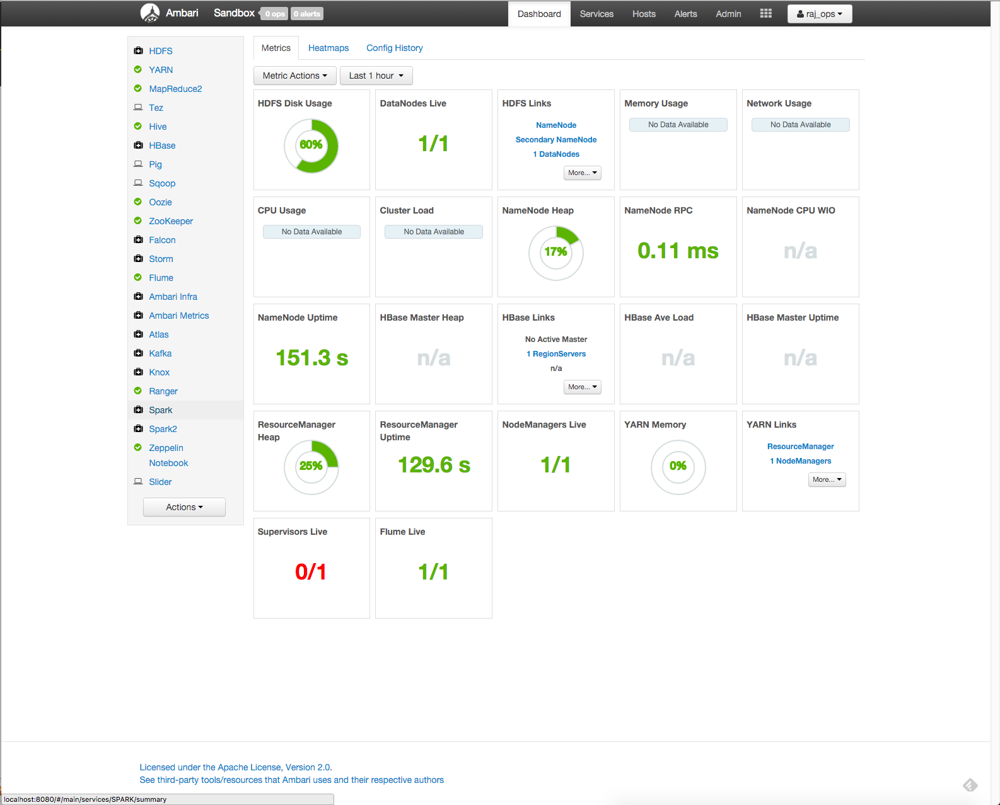

## Enable HBase

We are going to start the HBase service and turn off maintenance mode.  We want to compare this sandbox with another one we will start later to show the services are different.

Click on the HBase service.  The HBase summary page will be displayed.  Click the Services button and select the `Start` menu option.  You should see something simiarl to this:

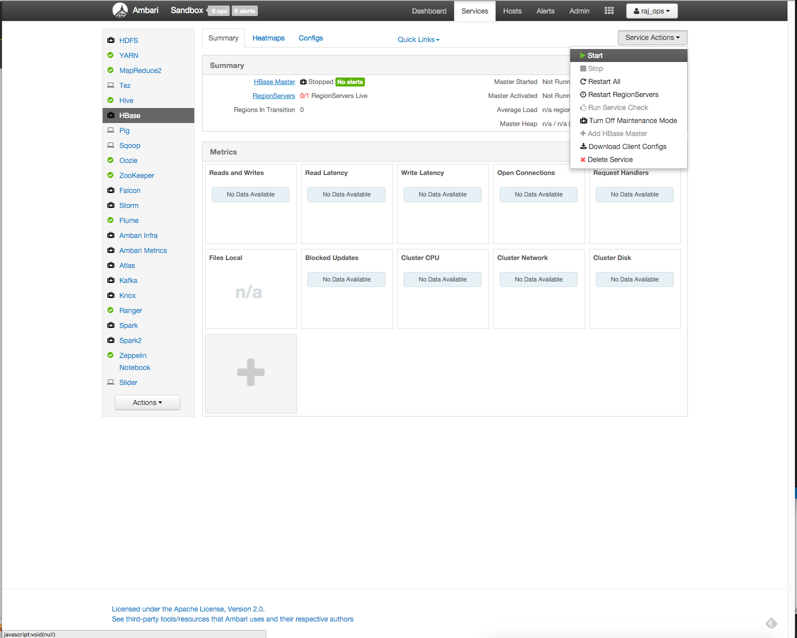

A confirmation dialog will be displayed.  Check the `Turn Off Maintenance Mode for HBase` and then click the green `Confirm Start` button.

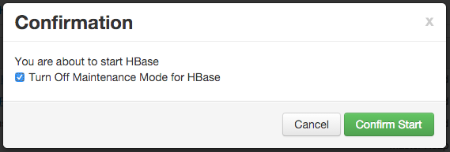

The Background Operation Running dialog will be displayed.  You should see something similar to this:

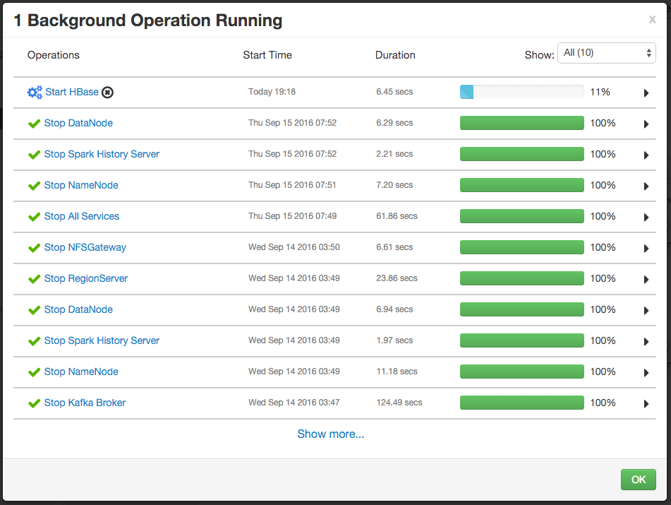

You can click the green `OK` button.

Once HBase is running, you should see something similar to this:

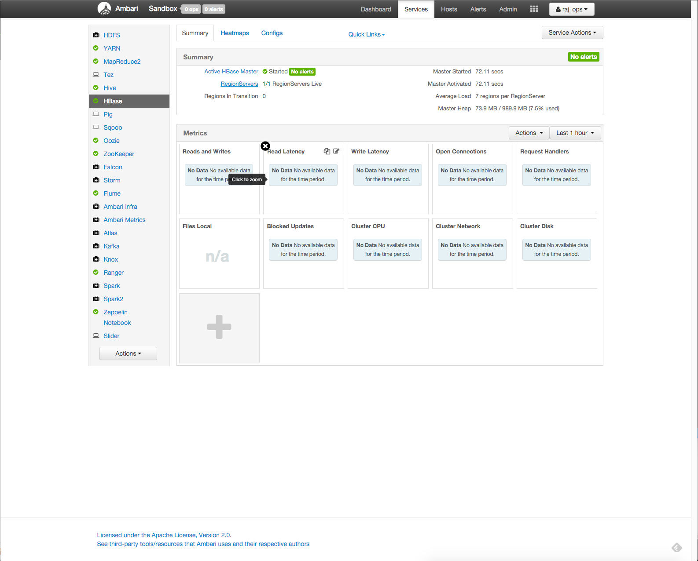

Notce that HBase is running and is no longer in maintenance mode.

## Upload file to HDFS home directory

We are going to upload a file to the user home directory on HDFS.  As mentioned in the previous section, we want to compare this sandbox with anoterh to show the directories are different.

Click on the Ambari Views menu in the upper right menu.  A drop down menu will be displayed.  You should see something similar to this:

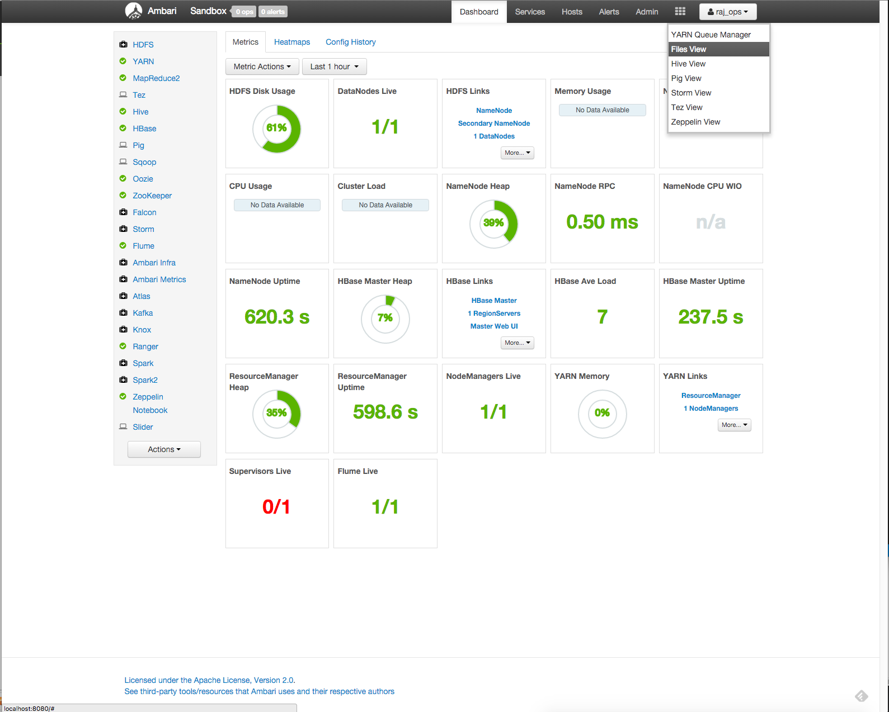

Click on the `Files View` option.  You should see something similar to this:

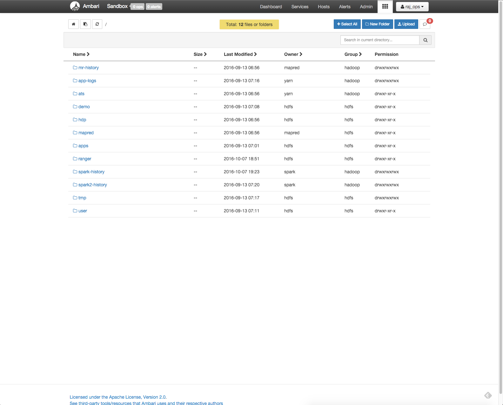

We are going to navigate to our user home directory.  We are logged in as `raj_ops`.  So click on the `user` folder, then the `raj_ops` folder.  You should see something similar to this:


Now we are going to upload a file.  Click on the blue `Upload` button.  You should see something similar to this:

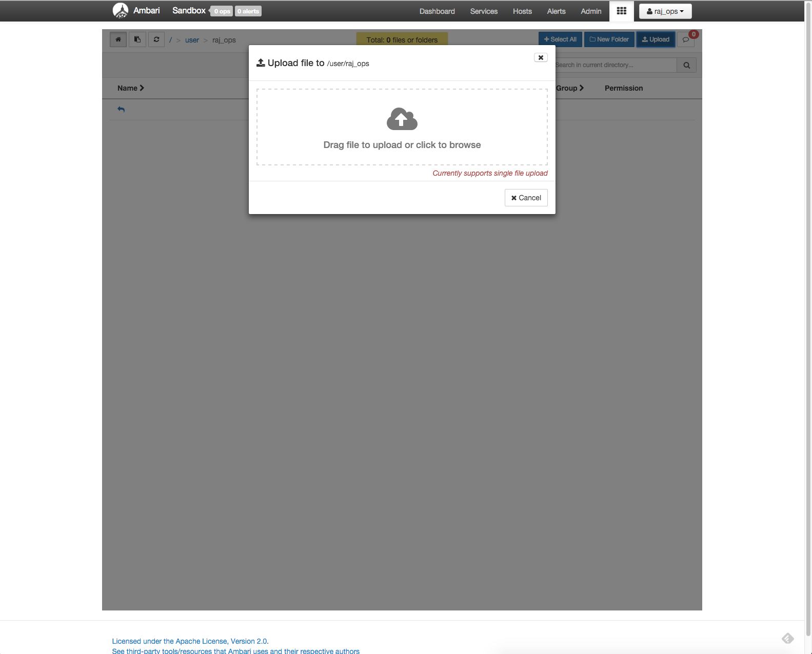

Click the cloud-arrow icon.  You should see a file dialog box that looks simlar to this:

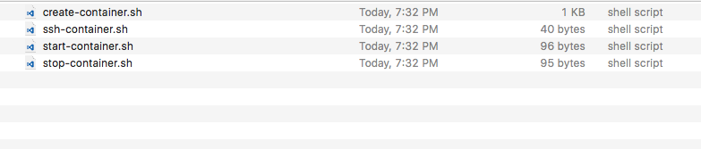

You should be in your project directory.  If you are not, nagivate it that location until you see the project helper files we create.  We are going to upload the start-container.sh script. Select the file and then click the `open` button.  You should see something similar to this:

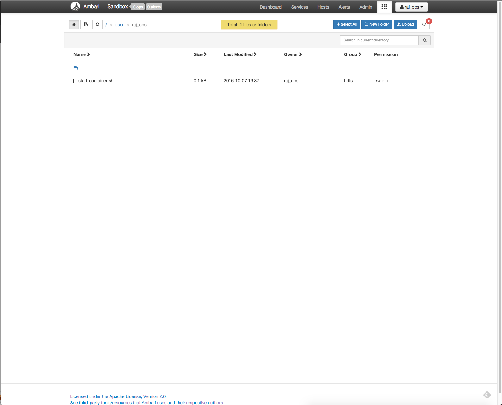

## Stop the atlas-demo1 container

Now we are going to stop our container.  Before stopping it, use Ambari to `Stop All` services.  You can find that link on the Ambari Dashboard:

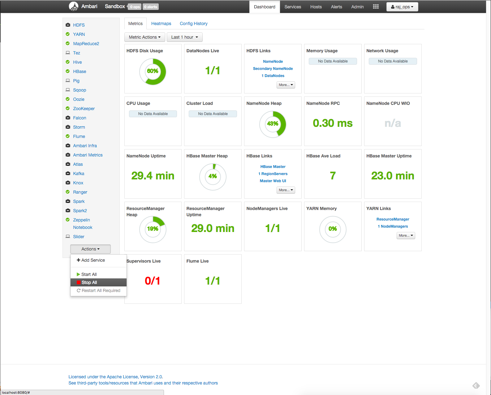

You stop your container by running the `stop-container.sh` script on the local host machine.

```bash
[root@sandbox ~]# exit
logout
Connection to localhost closed.
$ ./stop-container.sh
atlas-demo1
```

When you stop or start a container, Docker will always print the name of the container when it the command completes.

## Create the atlas-demo2 container

Now let's create a new project directory for comparison.  This will show that our two containers are not sharing configurations.

```bash
$ mkdir ~/Docker/atlas-demo2 && cd ~/Docker/atlas-demo2
```

## Copy helper scripts
There is no reason to copy/paste those helper scripts again.  The scripts we created will work anywhere.  So let's copy them.

```bash
$ cp ~/Docker/atlas-demo1/* .
$ ls
create-container.sh	ssh-container.sh	start-container.sh	stop-container.sh
```

## Create the atlas-demo2 container

This is a new container, so we need to run the `create-container.sh` script.

You should see something similar to the following:

```bash
$ ./create-container.sh
05e4710f3aaa1232b620a5d908003070a7b3d991c064ac09c04571a2fc1b2079
```

The output of the docker run command is the unique container id for our `atlas-demo2` container.  You can verify the container is running with the `docker ps` command:

```bash
$ docker ps
CONTAINER ID        IMAGE               COMMAND               CREATED              STATUS              PORTS                                                                                                                                                                                                                                                                                                                                                                                                                                                                                                                                                                                                                                                                                                                                                                                                                                                                                                                                                                                                                                                                                                                                                                                                                                                                                                                                                                                                                                              NAMES
05e4710f3aaa        sandbox             "/usr/sbin/sshd -D"   About a minute ago   Up 33 seconds       0.0.0.0:1000->1000/tcp, 0.0.0.0:1100->1100/tcp, 0.0.0.0:1220->1220/tcp, 0.0.0.0:1988->1988/tcp, 0.0.0.0:2100->2100/tcp, 0.0.0.0:2181->2181/tcp, 0.0.0.0:4040->4040/tcp, 0.0.0.0:4200->4200/tcp, 0.0.0.0:5007->5007/tcp, 0.0.0.0:5011->5011/tcp, 0.0.0.0:6001->6001/tcp, 0.0.0.0:6003->6003/tcp, 0.0.0.0:6008->6008/tcp, 0.0.0.0:6080->6080/tcp, 0.0.0.0:6188->6188/tcp, 0.0.0.0:8000->8000/tcp, 0.0.0.0:8005->8005/tcp, 0.0.0.0:8020->8020/tcp, 0.0.0.0:8040->8040/tcp, 0.0.0.0:8042->8042/tcp, 0.0.0.0:8050->8050/tcp, 0.0.0.0:8080->8080/tcp, 0.0.0.0:8082->8082/tcp, 0.0.0.0:8086->8086/tcp, 0.0.0.0:8088->8088/tcp, 0.0.0.0:8090-8091->8090-8091/tcp, 0.0.0.0:8188->8188/tcp, 0.0.0.0:8443->8443/tcp, 0.0.0.0:8744->8744/tcp, 0.0.0.0:8765->8765/tcp, 0.0.0.0:8886->8886/tcp, 0.0.0.0:8888-8889->8888-8889/tcp, 0.0.0.0:8983->8983/tcp, 0.0.0.0:8993->8993/tcp, 0.0.0.0:9000->9000/tcp, 0.0.0.0:9090->9090/tcp, 0.0.0.0:9995-9996->9995-9996/tcp, 0.0.0.0:10000-10001->10000-10001/tcp, 0.0.0.0:10500->10500/tcp, 0.0.0.0:11000->11000/tcp, 0.0.0.0:15000->15000/tcp, 0.0.0.0:16010->16010/tcp, 0.0.0.0:16030->16030/tcp, 0.0.0.0:18080->18080/tcp, 0.0.0.0:19888->19888/tcp, 0.0.0.0:21000->21000/tcp, 0.0.0.0:42111->42111/tcp, 0.0.0.0:50070->50070/tcp, 0.0.0.0:50075->50075/tcp, 0.0.0.0:50095->50095/tcp, 0.0.0.0:50111->50111/tcp, 0.0.0.0:60000->60000/tcp, 0.0.0.0:60080->60080/tcp, 0.0.0.0:61888->61888/tcp, 0.0.0.0:2222->22/tcp   atlas-demo2
```

You should notice the shortened version of the container id is listed as `05e4710f3aaa`.  As before, this id matches the first 12 charactrers,  and it matches the output of our create-container.sh command.  Your container id value will be different.  You should also notice the name of the container is listed as `atlas-demo2`.

## Connect to the atlas-demo2 container

Now that the container is started, we can connect to it. We can use our new helper script `ssh-container.sh` to make it easy:

```bash
$ ./ssh-container.sh
```

Because this is a new container, you should be prompted for a password.  Change the password as you did with `atlas-demo1`.

## Verify container mounts

Let's verify our container mounts.  You do this with the `df` command:

```bash
[root@sandbox ~]# df -h
Filesystem      Size  Used Avail Use% Mounted on
none             60G   32G   25G  57% /
tmpfs           5.9G     0  5.9G   0% /dev
tmpfs           5.9G     0  5.9G   0% /sys/fs/cgroup
/dev/vda2        60G   32G   25G  57% /hadoop
/dev/vda2        60G   32G   25G  57% /etc/resolv.conf
/dev/vda2        60G   32G   25G  57% /etc/hostname
/dev/vda2        60G   32G   25G  57% /etc/hosts
shm              64M  8.0K   64M   1% /dev/shm
osxfs           233T   33T  201T  15% /Users/myoung/Documents/Docker/atlas-demo1
```

The first thing you should notice is the last entry.  My local project directory is mounted as `osxfs`.  Let's `ls` the `/mount` directory to see what's there:

```bash
[root@sandbox ~]# ls -la /Users/myoung/Documents/Docker/atlas-demo2
total 300
drwxr-xr-x 12 root root      408 Oct  7 22:52 .
drwxr-xr-x  3 root root     4096 Oct  7 22:57 ..
-rwxrwxr-x  1 root root     1199 Oct  7 23:31 create-container.sh
-rwxrwxr-x  1 root root       40 Oct  7 22:52 ssh-container.sh
-rwxrwxr-x  1 root root       96 Oct  7 22:48 start-container.sh
-rwxrwxr-x  1 root root       95 Oct  7 22:48 stop-container.sh
```

As before, you should see the 4 helper scripts we created.

## Start the sandbox processes

When the container starts up, it doesn't automatically start the sandbox processes.  You can do that by running the `/etc/inid./startup_script`.  You should see something similar to this:

```bash
[root@sandbox ~]# /etc/init.d/startup_script start
Starting tutorials...                                      [  Ok  ]
Starting startup_script...
Starting HDP ...
Starting mysql                                            [  OK  ]
Starting Flume                                            [  OK  ]
Starting Postgre SQL                                      [  OK  ]
Starting Ranger-admin                                     [WARNINGS]
find: failed to restore initial working directory: Permission denied
Starting data node                                        [  OK  ]
Starting name node                                        [  OK  ]
Safe mode is OFF
Starting Oozie                                            [  OK  ]
Starting Ranger-usersync                                  [  OK  ]
Starting Zookeeper nodes                                  [  OK  ]
Starting NFS portmap                                      [  OK  ]
Starting Hdfs nfs                                         [  OK  ]
Starting Hive server                                      [  OK  ]
Starting Hiveserver2                                      [  OK  ]
Starting Ambari server                                    [  OK  ]
Starting Ambari agent                                     [  OK  ]
Starting Node manager                                     [  OK  ]
Starting Yarn history server                              [  OK  ]
Starting Webhcat server                                   [  OK  ]
Starting Spark                                            [  OK  ]
Starting Mapred history server                            [  OK  ]
Starting Zeppelin                                         [  OK  ]
Starting Resource manager                                 [  OK  ]
Safe mode is OFF
Starting sandbox...
/etc/init.d/startup_script: line 97: /proc/sys/kernel/hung_task_timeout_secs: No such file or directory
Starting shellinaboxd:                                     [  OK  ]
```

**NOTE: You can ignore any warnings or errors that are displayed.**

## Check Ambari Services

We are going to look at the services in Ambari.  In the old container we turned off maintenance mode.  Login with the `raj_ops` username and password.

You should see something similar to this:

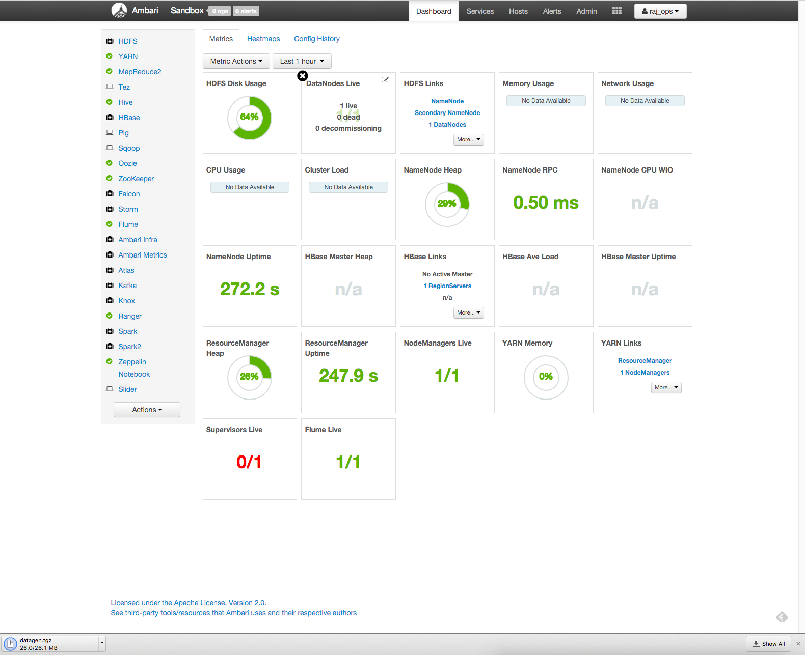

You should notice that the HBase service has maintenance mode turn on.

## Check HDFS home directory

Now nagivate the `raj_ops` HDFS home directory using the Ambari Files View.  Follow the process above up to get to the home directory.  You should see something similar to this:

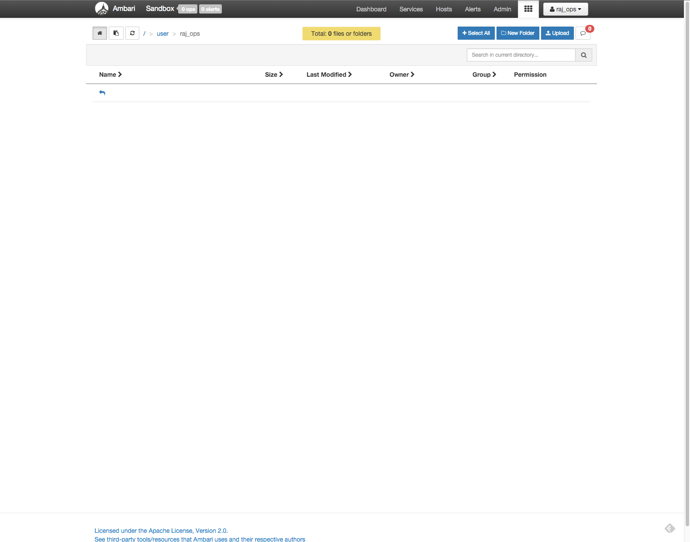

Notice the file we uploaded in the other container is not here.

## Stop the atlas-demo2 container

Now we are going to stop our container.  Before stopping it, use Ambari to `Stop All` services as you did before.  Then you run the `stop-container.sh` script:

You stop your container by running the `stop-container.sh` script on the local host machine.

```bash
[root@sandbox ~]# exit
logout
Connection to localhost closed.
$ ./stop-container.sh
atlas-demo2
```

## Starting created containers

As mentioned above, the create process will autostart the containers.  After you stop them, you need to run the `start-conatiner.sh` script, which simply runs `docker start <container>`.

```bash
$ ./start-container.sh
atlas-demo2
```

Again, the Docker start command will print the name of the container when it completes.

## Deleting containers

If you decide you no longer need a container, you can easily delete it.  Before you ca delete the container, you need to stop it first.  Once it is stopped, you us the `docker rm` command:

```bash
$ docker rm atlas-demo1
atlas-demo1
```

As with the start and stop command, the `rm` command will print the name of the container when the command completes.

If the container is not running, the docker command will display the following:

```bash
$ docker stop atlas-demo1
Error response from daemon: No such container: atlas-demo1
```

That means the container is already stopped and can be deleted

## Note on disk utilization

While the containers do not share configurations, they all run on the same Docker virtual machine.  This means that you should properly manage the number of containers you are using as the storage space of the VM will become an issue.

Here is a quick screenshot of my disk usage in Ambari:
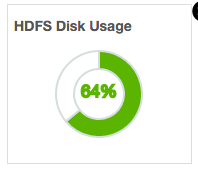
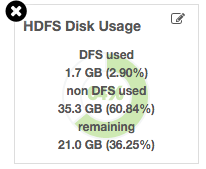

Let's see what your disk usage looks like at the commandline:

```bash
$ docker run --rm -it -v /:/vm-root alpine:edge df -h /
Filesystem                Size      Used Available Use% Mounted on
none                     59.0G     33.8G     22.2G  60% /
```

I'm going to delete the two atlas demo containers to see if that changes my disk utilization.

```bash
$ docker rm atlas-demo1
atlas-demo1
$ docker rm atlas-demo2
atlas-demo2
```

Now let's look at my disk utilization:

```bash
$ docker run --rm -it -v /:/vm-root alpine:edge df -h /
Filesystem                Size      Used Available Use% Mounted on
none                     59.0G     33.1G     22.9G  59% /
```

Here is what ambari looks like for a differnet container I have running:

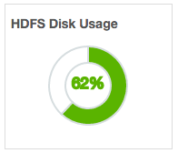
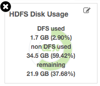

## Review

If you successfully followed along with this tutorial, you now have an easy way to create HDP Docker based sandboxes that don't share configuration.  You have a few scripts to make the management process easier.